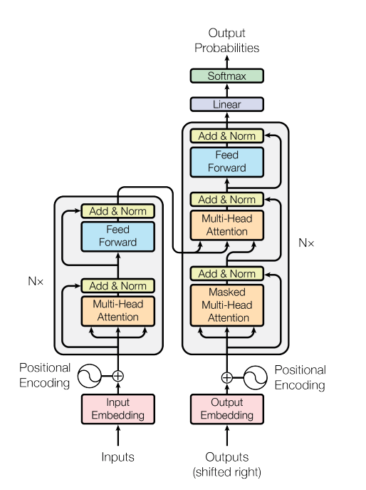
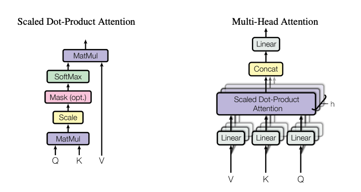

# Attention Is All You Need

* [Paper](https://arxiv.org/pdf/1706.03762.pdf)

This repository contains my implementation of the (Vanilla) Transformer model from 2017 using PyTorch.

## Model architecture 



### Components



## Training 

You can train your Transformer model from scratch after creating an environment based on the `requirements.txt`. The configurations (`config.py`) are from the original paper, you can change them if necessary. The WMT14 dataset will be downloaded automatically.

Training with standard config:
```
python3 -m venv .env
source .env/bin/activate
pip install -r requirements.txt
# install pytorch (I worked with 1.9)
python3 train.py
```

## ToDos

* code for loading the data, I think I will use WMT14 EN-DE
* check if current implementation works correctly
* implement BLEU score evaluation
* translation/inference script
* multi-gpu training script
* (add support for more datasets)
* provide a download link for a pretrained model

## References


* [Attention? Attention!](https://lilianweng.github.io/lil-log/2018/06/24/attention-attention.html)
* [Pytorch Tutorial](https://pytorch.org/tutorials/beginner/translation_transformer.html)
* [The Annotated Transformer](http://nlp.seas.harvard.edu/2018/04/03/attention.html)
* [Annotated PyTorch Paper Implementations](https://nn.labml.ai/)